# Full Example
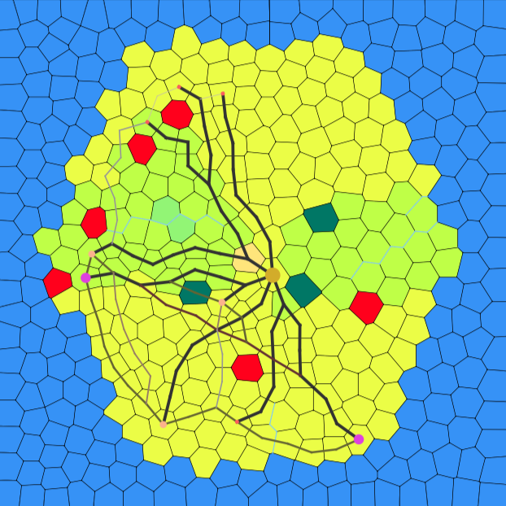
```
cd generator 
java -jar generator.jar input.mesh -ir -pt 0 -rl 40 -np 400
cd ..
```
```
cd island
java -jar island.jar -o island.mesh -i ../generator/input.mesh -mode hexagon -elevation volcano -soil wet -lake 5 -river 6 -aquifer 4 -seed 6812161995636894525 -biome warmtemperate -city 10
cd ..
```
```
cd visualizer 
java -jar visualizer.jar -i ../island/island.mesh -o island.svg
cd ..
```

# Island Generation

## Before Running
All of these examples assume you have run the following code before to set up a basic mesh:
```
cd generator 
java -jar generator.jar input.mesh -ir -pt 0 -rl 40 -np 400
cd ..
```

## Packed Dry Soil Warm Temperate Island
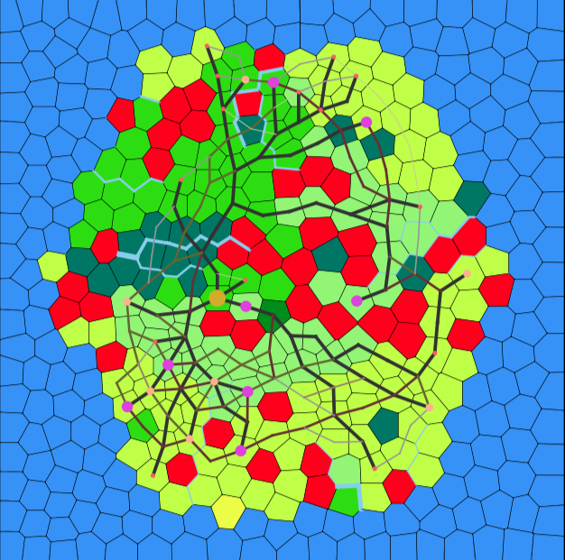

```
cd island
java -jar island.jar -o island.mesh -i ../generator/input.mesh -mode hexagon -elevation volcano -biome warmtemperate -soil dry -lake 40 -river 20 -aquifer 20 -seed 6812161995636894525 -city 30

cd ..

cd visualizer
java -jar visualizer.jar -i ../island/island.mesh -o island.svg
```

## Wet Soil Warm Temperate Island
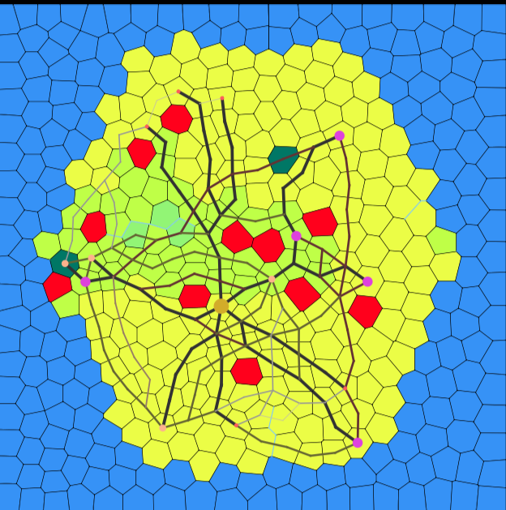
```
cd island
java -jar island.jar -o island.mesh -i ../generator/input.mesh -mode hexagon -elevation volcano -biome warmtemperate -soil wet -lake 10 -river 5 -aquifer 2 -seed 6812161995636894525 -city 15

cd ..

cd visualizer
java -jar visualizer.jar -i ../island/island.mesh -o island.svg
```

## Packed Dry Soil Arctic Island
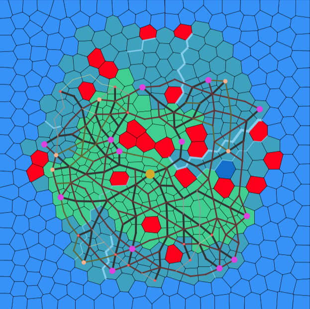
```
cd island
java -jar island.jar -o island.mesh -i ../generator/input.mesh -mode hexagon -elevation volcano -biome arctic -soil dry -lake 20 -river 10 -aquifer 2 -seed 6812161995636894525 -city 30

cd ..

cd visualizer
java -jar visualizer.jar -i ../island/island.mesh -o island.svg
```

## Wet Soil Arctic Island
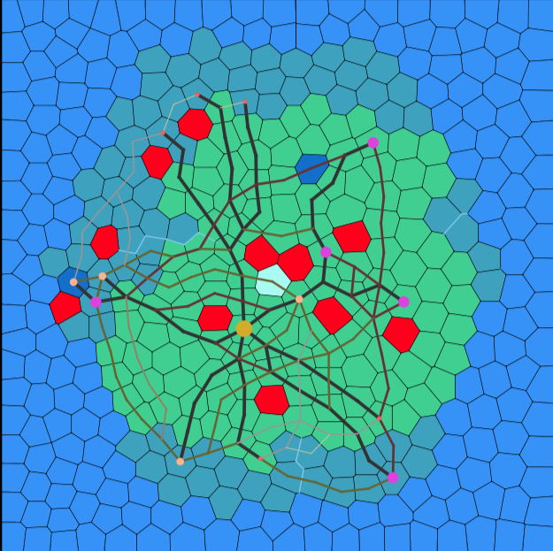
```
cd island
java -jar island.jar -o island.mesh -i ../generator/input.mesh -mode hexagon -elevation volcano -biome arctic -soil wet -lake 10 -river 5 -aquifer 2 -seed 6812161995636894525 -city 15

cd ..

cd visualizer
java -jar visualizer.jar -i ../island/island.mesh -o island.svg
```

## Hexagon Island With Cities
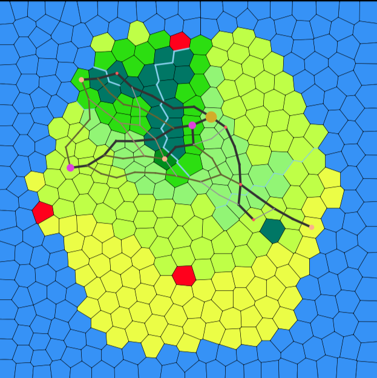
```
cd island
java -jar island.jar -o island.mesh -i ../generator/input.mesh -mode hexagon -elevation volcano -biome warmtemperate -soil wet -lake 2 -river 4 -aquifer 2 -seed 6812161995636894525 -city 10

cd ..

cd visualizer
java -jar visualizer.jar -i ../island/island.mesh -o island.svg
```

## Hexagon Island No Cities
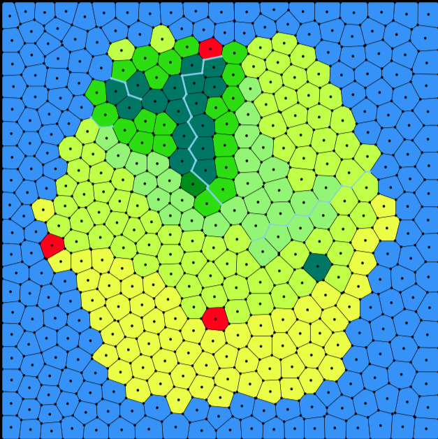
```
cd island
java -jar island.jar -o island.mesh -i ../generator/input.mesh -mode hexagon -elevation volcano -biome warmtemperate -soil wet -lake 2 -river 4 -aquifer 2 -seed 6812161995636894525

cd ..

cd visualizer
java -jar visualizer.jar -i ../island/island.mesh -o island.svg
```

## Heatmaps
### Moisture Heatmap
#### Dry Soil
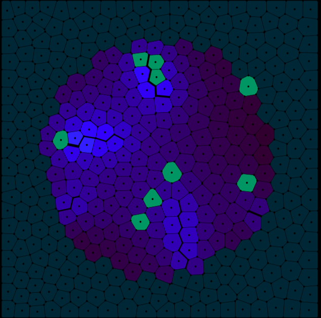
```
cd island
java -jar island.jar -o island.mesh -i ../generator/input.mesh -mode circle -elevation volcano -soil dry -lake 5 -river 8 -aquifer 3 -seed 6812161995636894525 -heatmap moisture

cd ..

cd visualizer
java -jar visualizer.jar -i ../island/island.mesh -o island.svg
```

#### Wet Soil
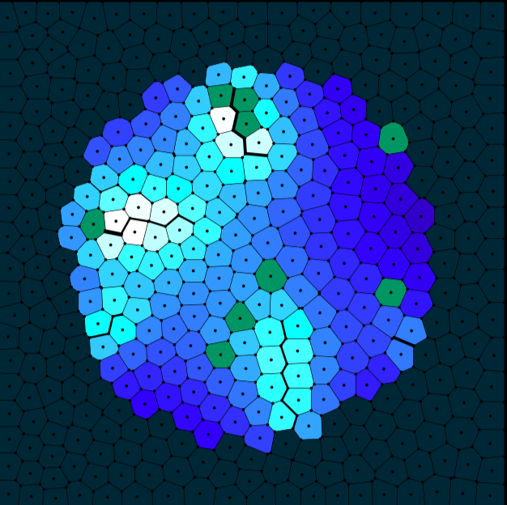
```
cd island
java -jar island.jar -o island.mesh -i ../generator/input.mesh -mode circle -elevation volcano -soil wet -lake 5 -river 8 -aquifer 3 -seed 6812161995636894525 -heatmap moisture

cd ..

cd visualizer
java -jar visualizer.jar -i ../island/island.mesh -o island.svg
```

### Elevation Heatmap Volcano
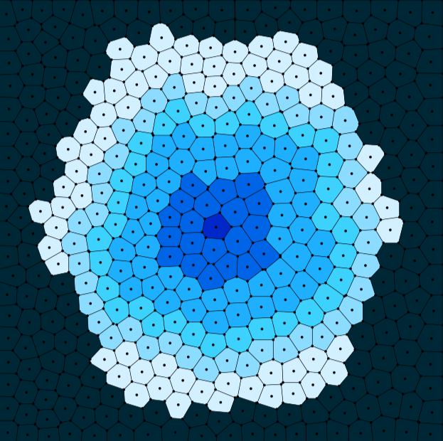

```
cd island
java -jar island.jar -o island.mesh -i ../generator/input.mesh -mode hexagon -elevation volcano -seed 6812161995636894525 -heatmap elevation

cd ..

cd visualizer
java -jar visualizer.jar -i ../island/island.mesh -o island.svg
```

### Vertex Elevation Heatmap Volcano
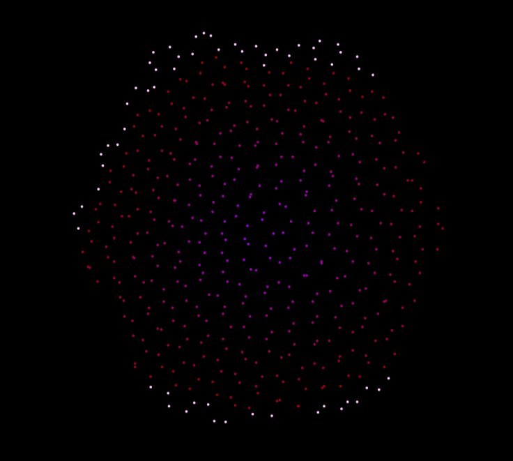

```
cd island
java -jar island.jar -o island.mesh -i ../generator/input.mesh -mode hexagon -elevation volcano -seed 6812161995636894525 -heatmap vertexelevation

cd ..

cd visualizer
java -jar visualizer.jar -i ../island/island.mesh -o island.svg
```

## No Biome
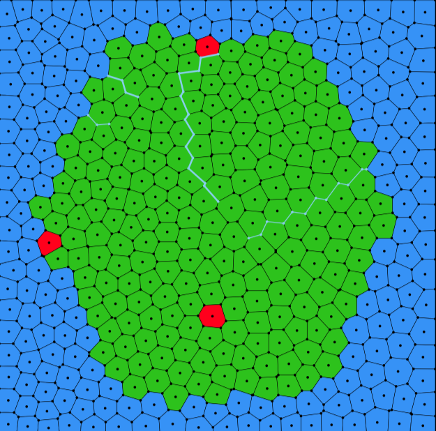

```
cd island
java -jar island.jar -o island.mesh -i ../generator/input.mesh -mode hexagon -elevation volcano -soil wet -lake 2 -river 4 -aquifer 2 -seed 6812161995636894525

cd ..

cd visualizer
java -jar visualizer.jar -i ../island/island.mesh -o island.svg
```

## Lagoon
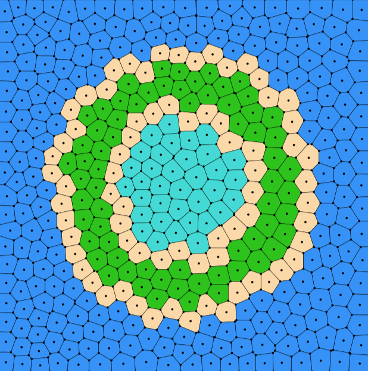

```
cd island
java -jar island.jar -o lagoon.mesh -i ../generator/input.mesh -mode lagoon -seed 2335384247420393129

cd ..

cd visualizer
java -jar visualizer.jar -i ../island/lagoon.mesh -o lagoon.svg
```

# Regular Mesh Generation

## Generate a Grid
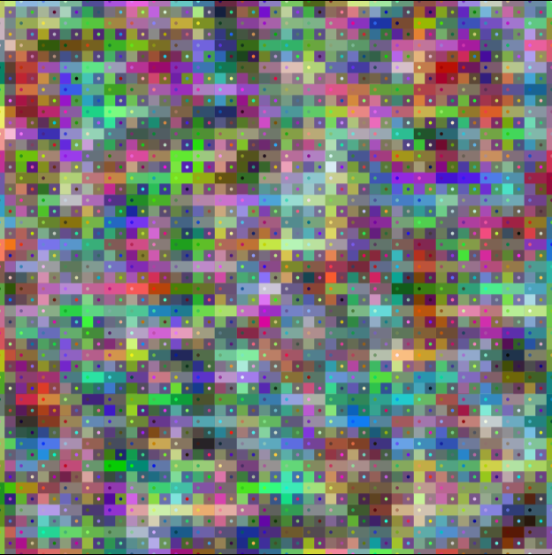

To generate a grid with the following specifications:
- polygon transparency of `200` (`-pa`)
- segment thickness of `10` (`-st`)
```
cd generator 
java -jar generator.jar sample.mesh -pa 200 -st 10

cd ..

cd visualizer
java -jar visualizer.jar -i ../generator/sample.mesh -o sample.svg 
```

## Generate a Grid in Debug 
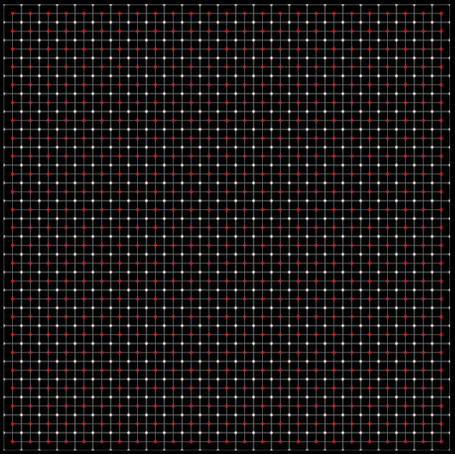

```
cd generator 
java -jar generator.jar sample.mesh

cd ..

cd visualizer 
java -jar visualizer.jar -i ../generator/sample.mesh -o sample.svg -X
```

## Generate an Irregular Mesh
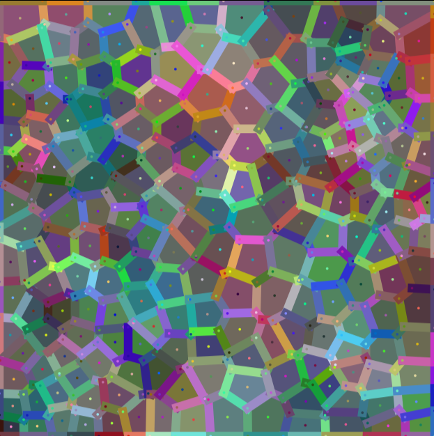

To generate an irregular mesh (`-ir`) with the following specifications: 
- `200` polygons (`-np`)
- relaxed `5` times (`-rl`)
- polygon transparency of `200` (`-pa`)
- segment thickness of `10` (`-st`)
- everything else `default`

```
cd generator 
java -jar generator.jar sample.mesh -ir -np 200 -rl 5 -pa 200 -st 10

cd ..

cd visualizer
java -jar visualizer.jar -i ../generator/sample.mesh -o sample.svg 
```

## Generate an Irregular Mesh in Debug Mode
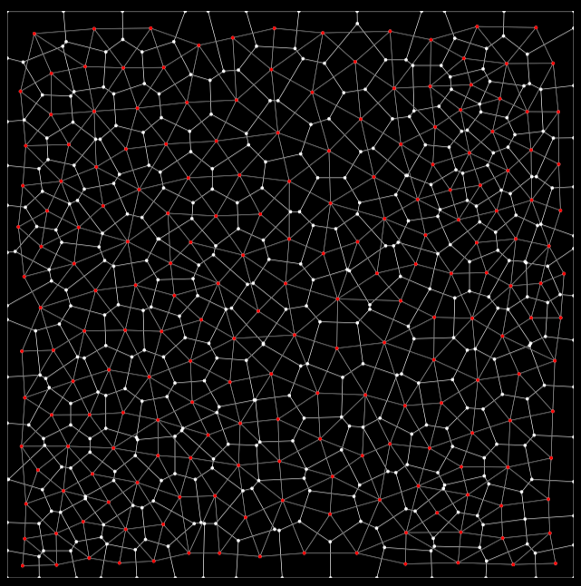

To generate an irregular mesh (`-ir`) in debug mode with the following specifications:
- `200` polygons (`-np`)
- relaxed `5` times (`-rl`)
- polygon transparency of `200` (`-pa`)
- segment thickness of `10` (`-st`)
- everything else `default`

Note that debug mode will normalize most of the specifications we want here.

```
cd generator 
java -jar generator.jar sample.mesh -ir -np 200 -rl 5 -pa 200 -st 10

cd ..

cd visualizer
java -jar visualizer.jar -i ../generator/sample.mesh -o sample.svg -X
```
